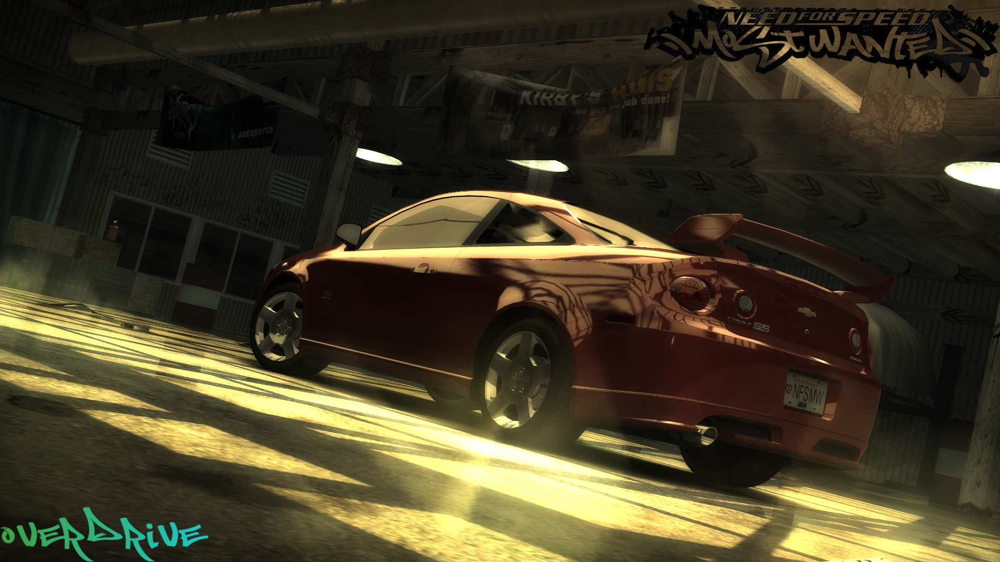

# NFSMW Overdrive

An ASI plugin for *Need for Speed: Most Wanted* (2005, PC).

**Five-speed cars get their sixth gear from the first transmission package
instead of the last.** Fit a Race gearbox to a Cobalt SS and it pulls sixth,
rather than making you wait for the Ultimate package.

Cars with a stock gearbox are untouched, and upgrading anything else — engine,
nitrous, tyres — does not trigger it.

## Install

Drop `NFSMWOverdrive.asi` and `NFSMWOverdrive.ini` into the game's
`scripts` folder. Uninstall by deleting the two files.

You need an ASI loader, which you already have if you run any other MW mods.
Plays nicely alongside Unlimiter, Bartender, ExtraOptions and the Widescreen
Fix.

## Settings

`NFSMWOverdrive.ini`, read once at launch.

| Key | Default | |
| --- | --- | --- |
| `[Gears] Enabled` | `1` | the feature |
| `[Gears] IncludeStock` | `0` | also give the 6th to cars with no gearbox upgrade |
| `[Debug] Log` | `0` | writes `NFSMWOverdrive.log` beside the `.asi` |
| `[Debug] Verbose` | `0` | logs every transmission collection built |

## Affected cars

The 31 with an upgraded gear set in the game's data:

`911turbo` `997s` `a3` `a4` `carreragt` `caymans` `clio` `clk500` `cobaltss`
`corvette` `cts` `db9` `eclipsegt` `elise` `fordgt` `gallardo` `gti` `gto`
`is300` `lancerevo8` `monaro` `murcielago` `mustanggt` `punto` `rx7` `rx8`
`sl500` `slr` `supra` `tt` `viper`

Cars absent from that list — the M3 GTR, SL65, Camaro, 911 GT2, and every cop,
traffic and semi entry — ship fully specced with no upgraded set to draw from.
Cars that already have six gears are left alone.

## Build

Visual Studio, `Release|Win32`. Output is `Release/NFSMWOverdrive.asi`.

| | |
| --- | --- |
| `src/Game.h` | addresses and structure offsets, with the disassembly they came from |
| `src/Tweaks.cpp` | the hook and the gear patch |
| `src/Hook.cpp` | 5-byte JMP detour with trampoline and byte check |
| `src/Config.cpp` | ini parsing |
| `src/Log.cpp` | optional logging |
